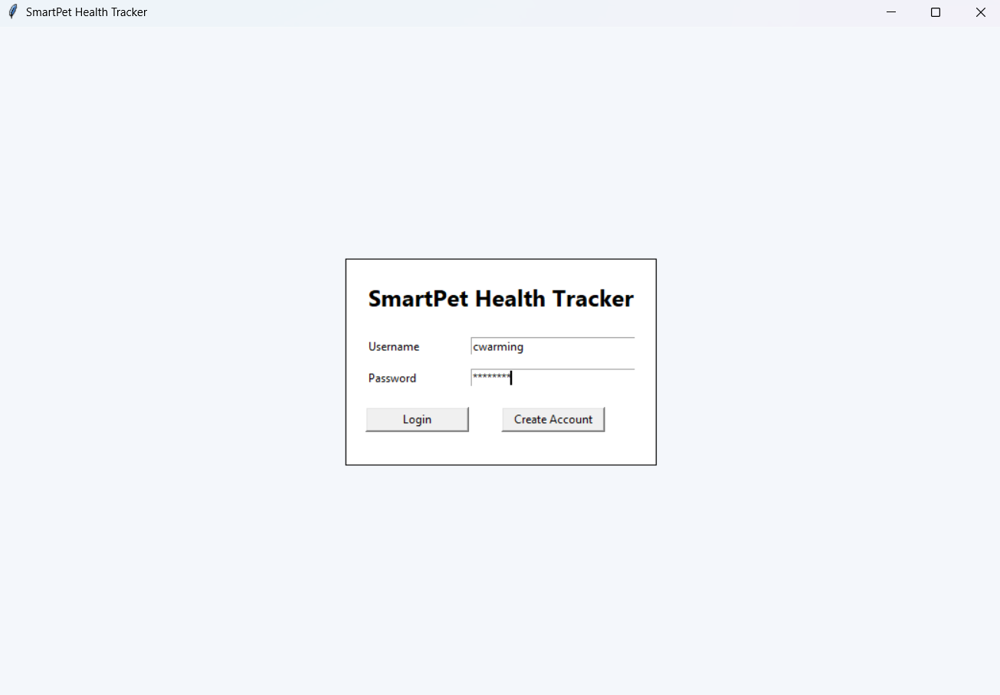
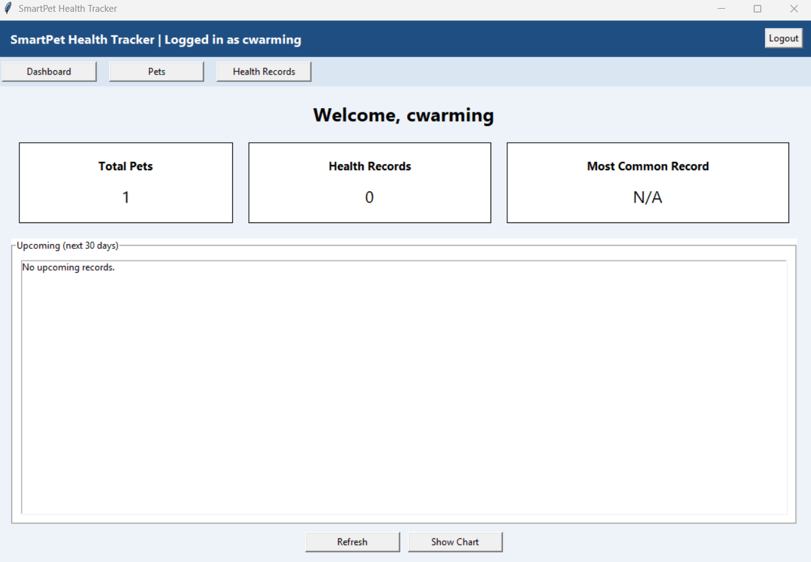
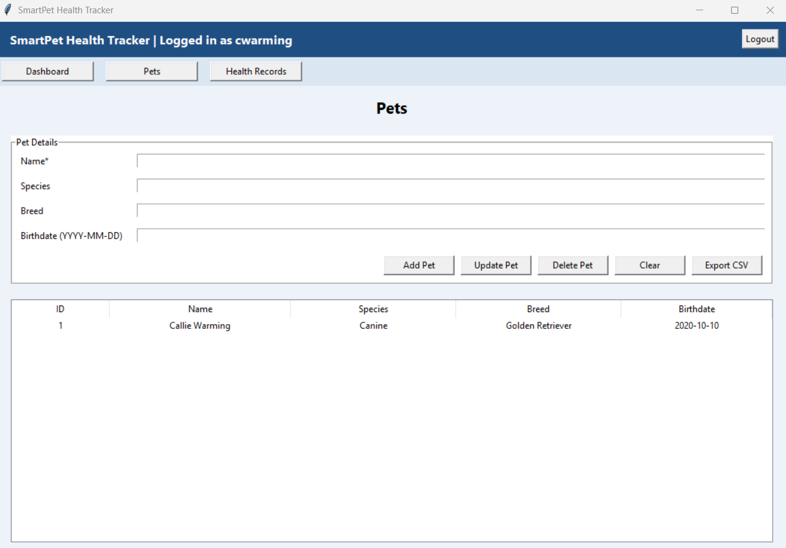
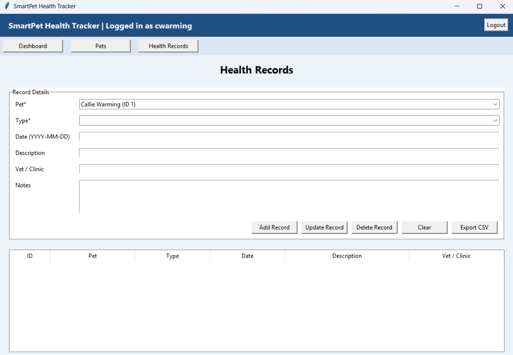

# SmartPet Health Tracker

## Overview
SmartPet Health Tracker is a desktop application built in Python that allows users to manage and track pet health records, including medical history and reminders.

## Features
- User login and authentication
- Add, update, and delete pets
- Track health records
- Dashboard with statistics
- Data visualization
- CSV export functionality

## Technologies Used
- Python
- Tkinter
- SQLite
- Matplotlib

## How to Run
pip install matplotlib  
python SmartPet Health Tracker.py

## Screenshots

### Login Screen

### Dashboard

### Pets Management

### Health Records

## Author
Connor Warming
